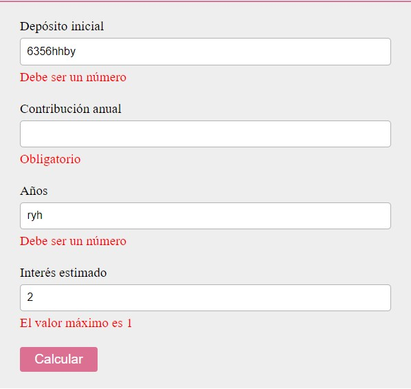

Calculadora de interés compuesto utilizando styled components.
Queda todo separado en componentes para utilizar como módulo dentro de otra aplicación mayor. 
El formulario utiliza la tecnología de formik y yup para las validaciones.

Esta es una muestra:

